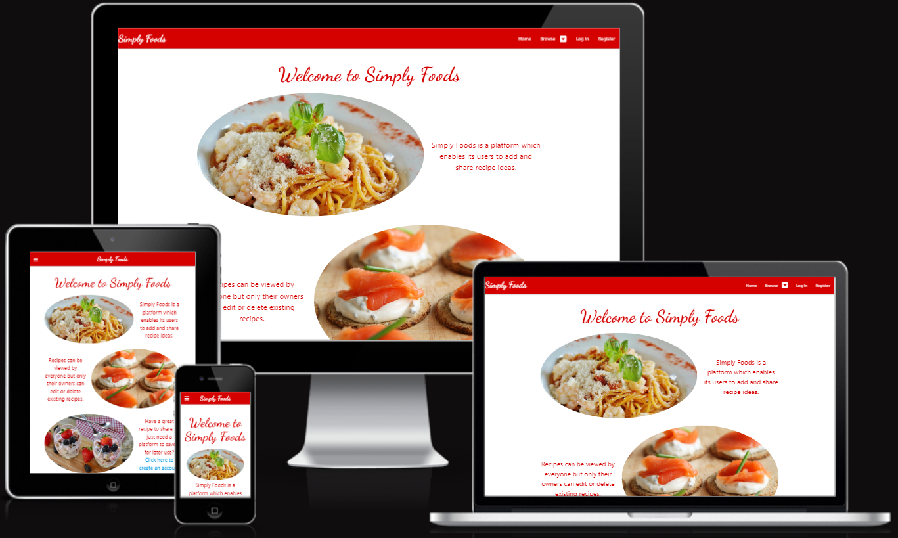
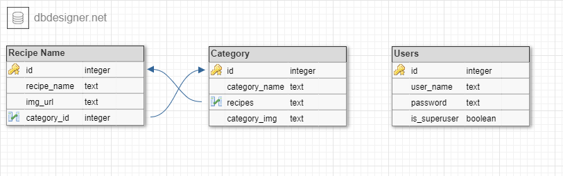
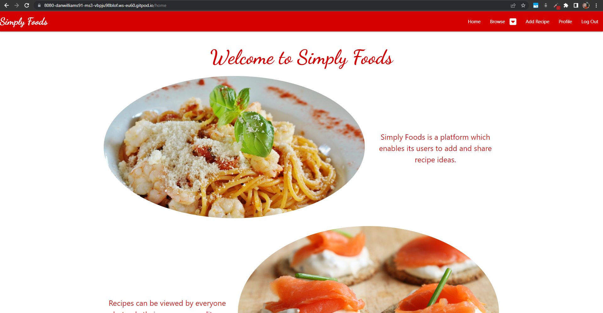
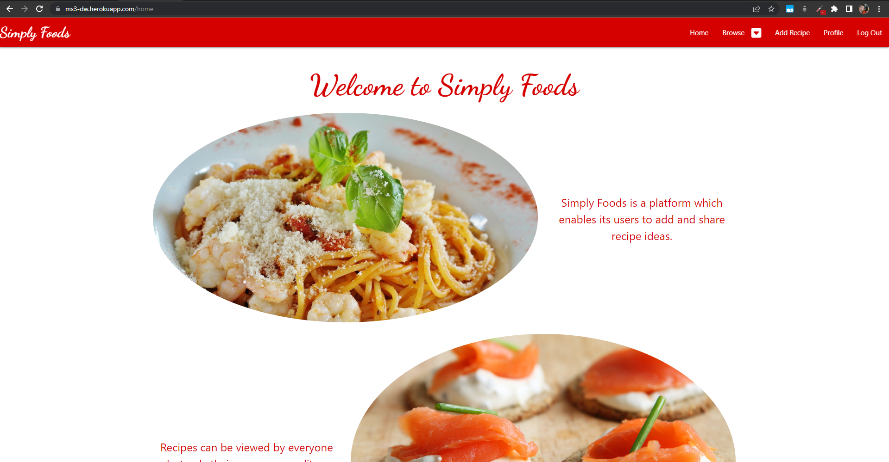

<h1 align="center">Simply Foods</h1>

[Link to the deployed website.](https://ms3-dw.herokuapp.com/home)

Simply Foods is a web application which enables its users to save and view recipes submitted by other users, as well as create their own for other users to view.  
The purpose of the website is to facilitate the sharing of recipe ideas between anyone and everyone. With its simple design and structure, the website is suited to everyone, regardless of their computer literacy.

<!--Below image sourced from sourced from http://ami.responsivedesign.is/-->

# Contents

Table of Contents - Click to Expand

- [User Experience (UX)](#user-experience-ux)
    - [User Stories](#user-stories)
- [Design and Structure](#design-and-structure)
    - [Colour Scheme](#colour-scheme)
    - [Typography](#typography)
    - [Imagery](#imagery)
    - [Wireframes](#wireframes)
    - [Database Schema](#database-schema)
- [Features](#features)
- [Technologies Used](#technologies-used)
    - [Languages Used](#languages-used)
    - [Frameworks, Libraries & Programs Used](#frameworks-libraries--programs-used)
- [Testing](#testing)
    - [HTML Validation](#html-validation)
    - [CSS Validation](#css-validation)
    - [JavaScript Validation](#javascript-validation)
    - [Python Validation](#python-validation)
    - [Manual Testing](#manual-testing)
    - [Testing User Stories from User Experience (UX) Section](#testing-user-stories-from-user-experience-ux-section)
    - [Further Testing](#further-testing)
    - [Bugs](#bugs)
- [Further Development](#further-development)
- [Deployment](#deployment)
    - [Deployment & Local Development](#deployment--local-development)
- [Credits](#credits)
    - [Code](#code)
    - [Content](#content)
    - [Media](#media)
    - [Other](#other)
- [Acknowledgements](#acknowledgements)

---

# User Experience (UX)
## User Stories
### New User Goals
    a)  As a new user, I expect to be able to quickly understand the purpose of the website.

    b)  As a new user, I want to be able to quickly and easily browse the website for existing content.

    c)  As a new user, I want it to be quick and simple to register in order to use the site's features.

### Regular User Goals
    a)  As a regular user, I expect the process of adding recipes to be simple and hassle-free.

    b)  As a regular user, I want to easily be able to view the recipes I’ve added to the website.

    c)  As a regular user, I want to be able to view the most recently added recipes with ease.

[Back to Contents](#contents)

# Design and Structure
## Colour Scheme
* The chosen colour scheme for the site is a mixture of reds. The main theme colour—used for the navbar, footer, modals and main headings—is a deep red colour, which enables white text to be contrasted well. A darker red colour is used for the background colours of cards.

## Typography
* The font used for the Site logo and page titles is [Dancing Script](https://fonts.google.com/specimen/Dancing+Script) in the red theme colour. Materialize’s default font is used for the remainder of the site.

## Imagery
* In order to give a good first impression to new users, the home page contains [three images](/appdir/assets/docs/screenshots/home-images.png) of high-quality foods. The aim of this is to give first-time users the impression that good quality recipes can be found on the site and that it is worth exploring deeper.

## Wireframes
* Home Page
    * [Mobile version.](/appdir/assets/docs/wireframes/home-sm.png)
    * [Medium/large screen version.](/appdir/assets/docs/wireframes/home-med-lg.png)
* [Login Page](/appdir/assets/docs/wireframes/login.png)
* Categories Page
    * [Mobile version.](/appdir/assets/docs/wireframes/categories-sm.png)
    * [Medium screen version.](/appdir/assets/docs/wireframes/categories-med.png)
    * [Large screen version.](/appdir/assets/docs/wireframes/categories-lg.png)
* Recipes Page
    * [Mobile version.](/appdir/assets/docs/wireframes/recipes-sm.png)
    * [Medium screen version.](/appdir/assets/docs/wireframes/recipes-med.png)
    * [Large screen version.](/appdir/assets/docs/wireframes/recipes-lg.png)
* Profile Page
    * [Mobile version.](/appdir/assets/docs/wireframes/profile-sm.png)
    * [Medium and larger screen version.](/appdir/assets/docs/wireframes/profile-lg.png)

## Database Schema
The application utilises a combination of both relational and non-relational databases: PostgreSQL and MongoDB, respectively.

The data managed by PostgreSQL consists of recipes, categories and users. An image representative of the PostgreSQL schema can be seen below:

Further Explanation:
* The recipe data includes a unique ID, a recipe name, a URL for the recipe's image source and a foreign key to manage which category the recipe is assigned to.
* The category data consists of a unique ID, a category name, a file name for the category's image (which is stored locally) and a relational column which links all the recipes which are assigned to the category. The nature of this relationship ensures that when a category is deleted by a superuser, all of its relative recipes are deleted with it - this makes sure that no recipes are unallocated to a category.
* The user data consists of a unique ID, the user's username, their password and a boolean value which represents whether the user is a site superuser.

The data stored on MongoDB consists of supplementary recipe data only. Each object contains a uniqe ID which corresponds to the ID of the recipe on the PostgreSQL database, along with arrays of recipe instructions and ingredients. Finally, each object also contains a key which stores the username of the user who created the recipe.

[Back to Contents](#contents)

# Features

* The entire website is responsive on all device sizes, with the grid layout changing according to the device in use.
* Each page contains a navbar for users’ ease of navigation throughout the site.
* On smaller devices, part of the navbar collapses into an expandable menu, enabling the text displayed in the navbar to remain at a legible size.
* A "Return to Top" link is located at the bottom of each page, enabling users to return to the top of the page they're currently viewing without the need for them to manually scroll the entire viewport.
* Whilst unregistered users can browse the content of the site, only registered users can add recipes. Once a user is logged in, the “Add a Recipe” link appears in the navbar.
* Additional features are available only to superusers, including:
    * the ability to manage registered users’ usernames and superuser status;
    * the ability to manage recipe categories, including CRUD functionality; and
    * the ability to manage all users’ recipes (non-superusers can only manage recipes they’ve added to the database).
* Defensive programming has been implemented to remove the possibility of unauthorised actions being performed by users without the required permissions.
    * Jinja templating has been utilised to ensure that only superusers are able to view the superuser options on their profile page.
    * The Python functions perform consistent checks to ensure that the logged-in user has the authorisation to visit specific pages, with unauthorised users being redirected to another page where authorisation does not exist.

[Back to Contents](#contents)

# Technologies Used

## Languages Used

* [HTML5](https://en.wikipedia.org/wiki/HTML5) was used for the content and structure of the site.
* [CSS3](https://en.wikipedia.org/wiki/CSS#CSS_3) was used for the styling of the site.
* [JavaScript](https://en.wikipedia.org/wiki/JavaScript) was used for the interactivity of the site.
* [Python](https://www.python.org/) was used for the back end programming of the site.

## Frameworks, Libraries & Programs Used 

1. [Materialize](https://materializecss.com/about.html)  
    Materialize was used to assist with the responsiveness and styling of the website.
2. [Google Fonts](https://fonts.google.com/)  
    Google fonts was used to import the ‘Dancing Script’ font into the style.css file which is used on pages throughout the website.
3. [Font Awesome](https://fontawesome.com/)  
    Font Awesome was used on pages throughout the website to add icons for aesthetic and user experience purposes.
4. [Git](https://git-scm.com/)  
    Git was used for version control by utilizing the Gitpod terminal to commit to Git and Push to GitHub.
5. [GitHub](https://github.com/)  
    GitHub is used to store the projects’ code after being pushed from Git.
6. [Heroku](https://devcenter.heroku.com/)  
    Heroku is used to host the live version of the deployed website.
7. [Balsamiq](https://balsamiq.com/wireframes/)  
    Balsamiq was used to create the wireframes during the design process.
8. [jQuery](https://jquery.com/)  
    jQuery was used to initialize Materialize components and apply event handlers to selectable items on the website.
9. [MongoDB](https://www.mongodb.com/)  
    MongoDB is used to host the non-relational database, used for storage of non-relational recipe data.
10. [PostgreSQL](https://www.postgresql.org/)  
    PostgreSQL is the relational database system used to store relational data for recipes, categories and users.
11. [Google Chrome](https://www.google.com/intl/en_uk/chrome/)  
    The Google Chrome browser was used throughout development for testing and feedback.
12. [Flask](https://flask.palletsprojects.com/en/2.2.x/)  
    Flask was used to handle the templating throughout the site’s HTML pages.
13. [Jinja](https://www.palletsprojects.com/p/jinja/)  
    Jinja was used as a templating engine for Python, allowing Python syntax to be implemented throughout the Flask HTML files.
14. [Werkzeug](https://werkzeug.palletsprojects.com/en/2.2.x/)  
    Werkzeug is a Web Server Gateway Interface (WSGI) web application library.
15. [dnspython](https://www.dnspython.org/)  
    Dnspython is a DNS toolkit for python.
16. [pip](https://pypi.org/project/pip/)  
    Pip is the package installer for Python, allowing the installation of packages from the Python Package Index.
17. [Flask-PyMongo](https://pypi.org/project/Flask-PyMongo/)  
    Flask-PyMongo was used to provide MongoDB support for the Flask application.
18. [SQLAlchemy](https://www.sqlalchemy.org/)  
    SQLAlchemy was used as an Object Relational Mapper in order to facilitate the communication between the Python program and databases.
19. [Flask-Migrate](https://flask-migrate.readthedocs.io/en/latest/)  
    Flask-Migrate was used to handle the SQLAlchemy database migrations for this Flask application.
20. [Microsoft Paint](https://en.wikipedia.org/wiki/Microsoft_Paint)  
    MS Paint was used to create the favicon image and edit screenshots for the README file.
21. [Favomatic](https://favicomatic.com/)  
    Favomatic was used to convert the favicon image into a useable size for use on the website.

[Back to Contents](#contents)

# Testing
## HTML Validation
The [W3C Markup Validator](https://validator.w3.org/) was used to validate the HTML of every page of the project to ensure there were no syntax errors present.

* Results:
    * [Home Page Results](/appdir/assets/docs/html-validation/home.pdf)
    * [All Recipes Page Results](/appdir/assets/docs/html-validation/all-recipes.pdf)
    * [All Recipes Page Results (with modal active)](/appdir/assets/docs/html-validation/all-recipes-page-modal-active.pdf)
    * ["Most Recent Recipes" Page Results](/appdir/assets/docs/html-validation/most-recent-recipes.pdf)
    * [All Categories Page Results](/appdir/assets/docs/html-validation/categories.pdf)
    * [Single Category View Page Results](/appdir/assets/docs/html-validation/category.pdf)
    * [Single Category View Page Results (with modal active)](/appdir/assets/docs/html-validation/category-page-modal-active.pdf)
    * [Registration Page Results](/appdir/assets/docs/html-validation/registration.pdf)
    * [Login Page Results](/appdir/assets/docs/html-validation/login.pdf)
    * [Profile Page Results](/appdir/assets/docs/html-validation/profile-page-superuser.pdf)
    * ["Add Category" Page Results](/appdir/assets/docs/html-validation/add-category.pdf)
    * ["Edit Category" Page Results](/appdir/assets/docs/html-validation/edit-category.pdf)
    * ["Add Recipe" Page Results](/appdir/assets/docs/html-validation/add-recipe.pdf)
    * ["Edit Recipe" Page Results](/appdir/assets/docs/html-validation/edit-recipe.pdf)
    * ["Edit User" Page Results](/appdir/assets/docs/html-validation/edit-user.pdf)
    * ["Manage Categories" Page Results](/appdir/assets/docs/html-validation/manage-categories.pdf)
    * ["Manage Recipes" Page Results](/appdir/assets/docs/html-validation/manage-recipes.pdf)
    * ["My Recipes" Page Results](/appdir/assets/docs/html-validation/my-recipes.pdf)

## CSS Validation
The [W3C CSS Validator](https://jigsaw.w3.org/css-validator/) was used to validate the CSS file used to style the website.
* [View Results.](appdir/assets/docs/css-validation/css-results.pdf)

## JavaScript Validation
The [JSHint tool](https://jshint.com/) was used to validate the JavaScript code and to identify any errors present.
* [View Results.](appdir/assets/docs/js-validation/script-validation.pdf)

## Python Validation
The [PEP8 Online Validator](http://pep8online.com/) was used to validate the Python code and ensure all files were PEP8 compliant.
* [View Results: init.py.](appdir/assets/docs/python-validation/init.pdf)
* [View Results: models.py.](appdir/assets/docs/python-validation/models.pdf)
* [View Results: routes.py.](appdir/assets/docs/python-validation/routes.pdf)

## Manual Testing
Throughout the entirety of the project, manual testing was utilised to ensure that functions worked as intended and user feedback behaved as expected. This involved extensive use of in-browser testing where [Chrome DevTools](https://developer.chrome.com/docs/devtools/) was used to view layout changes in real-time, as well as testing the app routes and user feedback.

Each time a Git commit was pushed to GitHub, the deployed version of the site (hosted by Heroku) was tested to ensure that it matched the development version.

### Local Version:

### Final Deployed Version:

## Testing User Stories from User Experience (UX) Section

* ### New User Goals
    a)  As a new user, I expect to be able to quickly understand the purpose of the website. 
    * Upon first visiting the website, the user is taken to the [Home page](/appdir/assets/docs/screenshots/site-purpose.png), which clearly explains the purpose of the site and what it is able to offer.

    b)  As a new user, I want to be able to quickly and easily browse the website for existing content.
    * Within the navbar, there is a [browse dropdown button](/appdir/assets/docs/screenshots/browse.png), which drops down to reveal [multiple options](/appdir/assets/docs/screenshots/browse-dropdown.png) to browse through the website content.
    * On smaller screens, the [browsing options](/appdir/assets/docs/screenshots/mobile-browse.png) are invididually displayed within the collapsible menu.
    
    c)  As a new user, I want it to be quick and simple to register as a user.   
    * The navbar, present on every page, contains a [link to register](/appdir/assets/docs/screenshots/navbar-register.png) (only viewable to users not logged in).
    * The home page - the first page viewed when visiting the site - also contains a [link](/appdir/assets/docs/screenshots/register-prompt.png) which navigates to the [registration page](/appdir/assets/docs/screenshots/registration-page.png).

* ### Regular User Goals
    a)  As a regular user, I expect the process of adding recipes to be simple and hassle-free.  
    * The navbar, present on every page, contains a [link to add a new recipe](/appdir/assets/docs/screenshots/navbar-add-recipe.png), which is viewable only to logged-in users.
    * For mobile users, the [collapsible menu](/appdir/assets/docs/screenshots/mobile-add-recipe.png) also contains a link to add a new recipe.
    * Each user's [profile page](/appdir/assets/docs/screenshots/profile-add-recipe.png) also contains a link to add a new recipe.

    b)  As a regular user, I want to easily be able to view the recipes I’ve added to the website.  
    * Upon logging in, the user is immediately directed to their [profile page](/appdir/assets/docs/screenshots/profile.png). From here, the [first link](/appdir/assets/docs/screenshots/profile-my-recipes.png) available to the user is to view recipes they've added to the database.

    c)  As a regular user, I want to be able to view the most recently added recipes with ease.
    * Within the navbar, there is a [browse dropdown button](/appdir/assets/docs/screenshots/browse.png), which drops down to reveal an option to [browse recipes in order of most recently added.](/appdir/assets/docs/screenshots/navbar-recent.png)
    * On smaller screens, the [Browse Most Recent](/appdir/assets/docs/screenshots/menu-most-recent.png) is displayed within the collapsible menu.

## Further Testing
* The Website was tested on Google Chrome, Mozilla Firefox and Microsoft Edge browsers.
* The website was viewed on a variety of devices such as Desktop, Laptop, iPhone 11 and Google Pixel 5.
* A large amount of testing was done to ensure that all pages were linking correctly.
* Friends and family members were asked to review the site and documentation to point out any bugs and/or user experience issues.

## Bugs
* Using Materialize's "valign-wrapper" class seemed to not allow the columns to span across the entire container on smaller screens (using class "s12") 
    * A class of "valign-workaround" was created as a workaround to this issue. Using CSS and JavaScript, the "valign-wrapper" class is replaced with the "valign-workaround" class on smaller devices. The result of this is that all columns now span across the container width, regardless of device size.
* HTML "option" elements with the attribute of "disabled" were rendering as inputs with the attribute of "readonly='true'", which led to HTML validation errors. 
    * The workaround for this issue was to use jQuery to remove the "readonly='true'" attribute and replace it with a "readonly" attribute without any values. The rendered HTML code now passes validation with no errors.

[Back to Contents](#contents)
    
# Further Development

There are many opportunities for further development of the site, some of which are listed below. Although there are benefits to adding the following aspects and features, the developer has decided that they are outside the scope of the project and the additional time spent on their implementation would bring no further value when considering the project's scope.

* An option for registered users to save or "favourite" specific recipes would be beneficial for the site's users; they could have a list of saved recipes to refer to later.
* Options for users to change their username and passwords would be beneficial to users. Adding funtionality for users to reset their forgotten passwords would also help ensure that more users are able to return to the site for future use.
    * The requirement of a user's email address for the purposes of password resetting could also bring potential benefits to the site owner, allowing the possibility of advertising in the form of emails.
* Image hosting capabilities would improve page loading times and allow users to directly upload images to the website, rather than having to host the images elsewhere and provide a link to the image.
* Adding further options to recipe data would be beneficial to the site's users.
    * Adding an option to define the cuisine of the recipe (for example, Mexican or Chinese) would better enable users to find recipes that are more suited to their tastes.
    * Adding options to provide tags for recipes - such as "vegan", for example - and allergy information would allow a wider range of users to use the site more easily. The benefits of these would be greater if a more intricate filtering feature was also implemented.
* Adding options for recipe cooking times and required equipment would also beenfit users as they would be more informed about how much time and what equipment is needed to cook recipes.

[Back to Contents](#contents)

# Deployment

## Deployment & Local Development

### Deployment to Heroku
Heroku was used to deploy this project. The deployed version is the same as in the repository. The steps used for deployment to Heroku are as follows:
1. To create a requirements.txt file containing project dependencies, navigate to the GitPod CLI in the root directoy of the project, and run:  
    >pip3 free --local > requirements.txt
2. In the Gitpod project workspace root directory, create a new file called Procfile, with capital 'P'.
    Open the Procfile. Inside the file, check that the following code is present within the Procfile, and make sure the file is saved once the code is present:
    >web: python3 app.py
3.  Login to Heroku, select _Create New App_. Enter the desired name for your app, making sure it does not contain any spaces, then choose your closest region.
4. Navigate to the _Deploy_ tab on Heroku dashboard and select _Github_, _search for your repository_ and click _connect_.
5. Navigate to the _settings_ tab, click _reveal config vars_ and input the following:

| Key | Value |
| :---: | :---: |
| CLOUD_NAME | mycloudinaryname  |
| API_KEY | myapikey |
| API_SECRET | myapisecret |
| IP | 0.0.0.0 |
| PORT | 5000 |
| MONGO_DBNAME | mongodb_name |
| MONGO_URI | mongodb+srv://<*USERNAME*>:<*PASSWORD*>@<*CLUSTER*>-4g3i1.mongodb.net/<*DATABASE*>?retryWrites=true&w=majority |
| SECRET_KEY | mysecretkey |
| DATABASE_URL | postgresql |

6. Go back to the _Deploy_ tab and select _enable automatic deploys_.
7. Click _deploy branch_.
8. Once the build has been completed, click _Open app_ to open the app.

### Local Development
To Fork the repository, use the following steps:  
* Login or signup to Github and locate the repository.
* Click the _Fork_ button in the top right corner.

### Making a Local Clone
* Log in or sign up to GitHub and locate the GitHub Repository.
* Under the repository name, click _clone_ or _download_.

To clone the repository using HTTPS, under _Clone with HTTPS_, copy the link.
Open the terminal in your preferred code editor and change the current working directory to the location you want to use for the cloned directory.
Type _git clone,_ and then paste the copied URL before pressing the enter key.Your clone will then be created.

[Back to Contents](#contents)

# Credits

## Code
* The code used for the button which takes the user back to the top of the page was taken and adapted from [this page](https://www.w3schools.com/howto/howto_js_scroll_to_top.asp) on w3schools.com.
* All icons used throughout the site were sourced from, and hosted by, [Font Awesome.](https://fontawesome.com/)

## Content
* All recipe content and photos were sourced from [Tesco Real Food](https://realfood.tesco.com/).
* This README file was produced using Code Institute’s [sample README file](https://github.com/Code-Institute-Solutions/SampleREADME/blob/master/README.md) as a template for both its layout and content.
* Much of the HTML and Python code structure was adapted from learning material provided by [Code Institute](https://codeinstitute.net/).

## Media
* Images used within the Home page and images assigned to categories were sourced from [Pixabay.](https://pixabay.com/)

## Other
* The database schema image was created using [DB Designer.](https://app.dbdesigner.net/)

[Back to Contents](#contents)

# Acknowledgements
* My Mentor, Chris Quinn, for his helpful feedback and assistance.
* Tutor support at Code Institute for their support.
* My friend, Colin French, and my partner, Nicola Williams, for assisting with site testing on different devices and providing valuable feedback.

[Back to Contents](#contents)